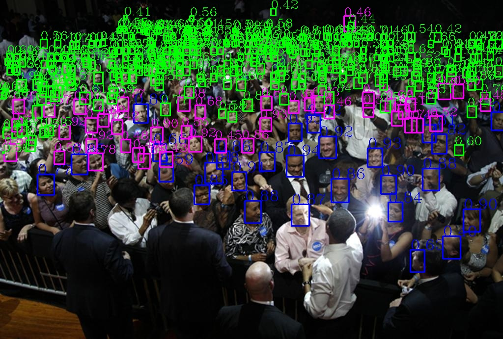

# Lightweight-Face-Detection-Playground
Implentment several single stage lightweight face detetors.

## Anchor-Base methods
- [ ] FaceBoxes
- [ ] RetinaFace

## Anchor-Free methods
- [ ] FCOS
- [x] CenterNet


## WIDER FACE results
|      | Params|Flops(640X640)|Easy|Medium|Hard|
|:----:|:-----:|:-----:|:----:|:-----:|:-----:|
|fcosface  |   |     | | | |
|centerface|146.68k|299.31MMac|| | |

## Demo


## How to train
1. Download [WIDER FACE](http://shuoyang1213.me/WIDERFACE/) dataset, e.g. place the images under this directory:
```
$/home/gyt/datasets/WIDERFACE/
```
2. Prepare your dataset in VOC format. e.g.
```
cd ./dataset/tools
python wider2voc.py --dataset_root /home/gyt/datasets/WIDERFACE/ --minium_face_size 5
```

3. Train the model using WIDER FACE:
```
sh ./bash/train_flashnet.sh
```

## How to eval performance

## How to play
1. Clone this repository. We will call the cloned directory as `$ROOT`.
```
git clone https://github.com/yongtaoge/Lightweight-Face-Detection-Playground.git
```
2. Config the running environment.
```
pip install requirements.txt
```
3. Compile the nms module.
```
sh compile.sh
```
4. Run demo.
```
python models/centerface.py
```

## Reference
```
@inproceedings{zhang2017faceboxes,
  title = {Faceboxes: A CPU Real-time Face Detector with High Accuracy},
  author = {Zhang, Shifeng and Zhu, Xiangyu and Lei, Zhen and Shi, Hailin and Wang, Xiaobo and Li, Stan Z.},
  booktitle = {IJCB},
  year = {2017}
}

@inproceedings{deng2019retinaface,
title={RetinaFace: Single-stage Dense Face Localisation in the Wild},
author={Deng, Jiankang and Guo, Jia and Yuxiang, Zhou and Jinke Yu and Irene Kotsia and Zafeiriou, Stefanos},
booktitle={arxiv},
year={2019}
}

@inproceedings{tian2019fcos,
  title   =  {{FCOS}: Fully Convolutional One-Stage Object Detection},
  author  =  {Tian, Zhi and Shen, Chunhua and Chen, Hao and He, Tong},
  booktitle =  {Proc. Int. Conf. Computer Vision (ICCV)},
  year    =  {2019}
}

@inproceedings{zhou2019objects,
  title={Objects as Points},
  author={Zhou, Xingyi and Wang, Dequan and Kr{\"a}henb{\"u}hl, Philipp},
  booktitle={arXiv preprint arXiv:1904.07850},
  year={2019}
}
```
